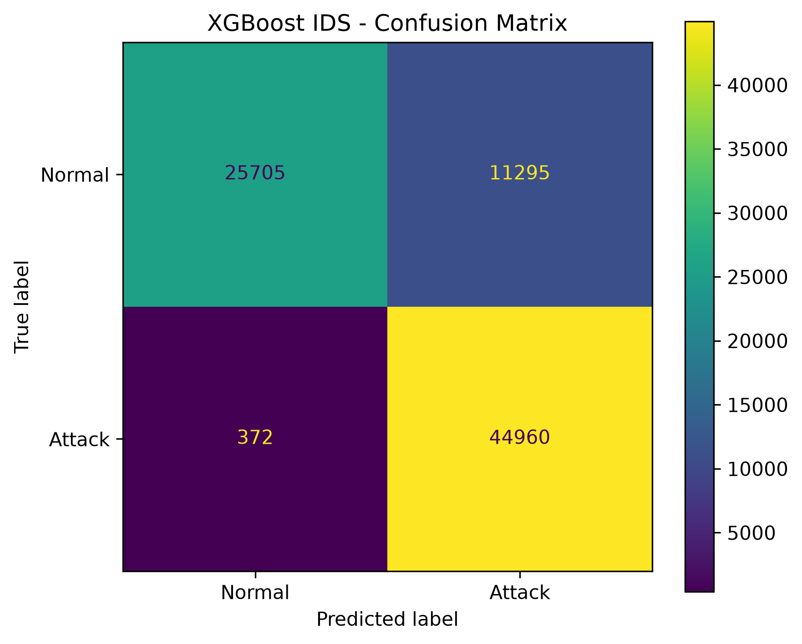
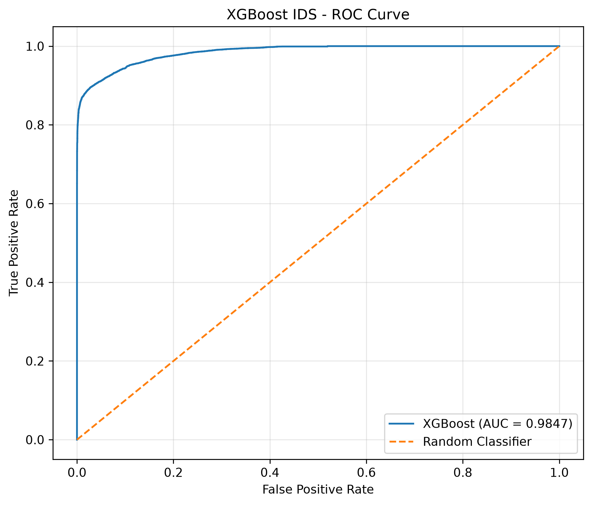
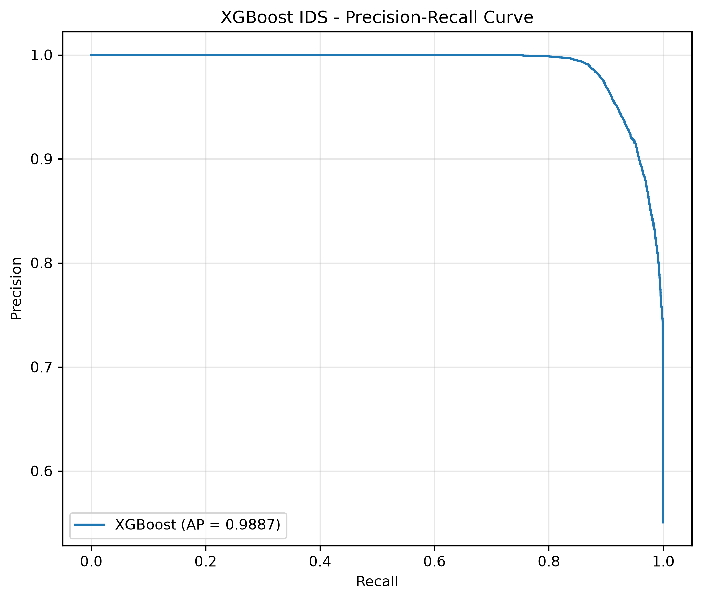
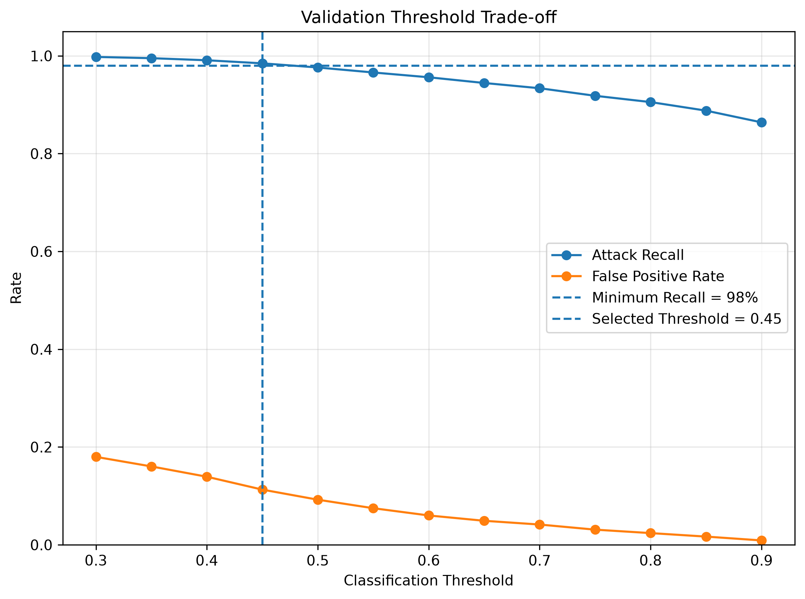

# AI-Based Network Intrusion Detection System
# 基於機器學習的網路入侵偵測系統

本專案使用 **UNSW-NB15** 網路入侵資料集，建立基於機器學習（Machine Learning）的網路入侵偵測系統（Intrusion Detection System, IDS）原型。

目前系統以 **Binary Classification（二元分類）** 為主要任務，將 Network Flow 分為：

- `0`：Normal（正常流量）
- `1`：Attack（攻擊流量）

目前已完成 Logistic Regression、Random Forest 與 XGBoost 三種模型的訓練與比較，並建立 Train / Validation / Test 評估流程。AI-IDS v1.0 使用 XGBoost 作為 Final Model，Threshold 由 Validation Set 在「Attack Recall ≥ 98%」的實驗約束下選定為 0.45；模型可保存及重新載入，並已整合至 Streamlit Dashboard，可對符合 UNSW-NB15 42-Feature Schema 的外部 CSV Network Flow 資料進行驗證、推論、警示、視覺化與結果下載。

---

## 專案目標

本專案希望探討機器學習應用於 Network Intrusion Detection 時的以下問題：

1. 不同機器學習模型在入侵偵測上的表現差異。
2. False Positive（誤報）與 False Negative（漏報）對 IDS 的影響。
3. Classification Threshold 對攻擊偵測率與誤報率的影響。
4. 如何將模型訓練流程與實際推論流程分離。
5. 如何建立可接受新 Network Flow 資料的 IDS Prototype。

---

## Dataset

本專案使用 **UNSW-NB15 Dataset**。

目前使用：

| Dataset | Samples | Columns |
|---|---:|---:|
| Training Set | 175,341 | 45 |
| Testing Set | 82,332 | 45 |

原始資料包含：

- Network Flow Features
- `attack_cat`
- `label`
- `id`

模型訓練時移除：

```text
id
attack_cat
label
```

因此實際輸入模型的原始 Features 為：

```text
42 Features
```

其中：

```text
3 Categorical Features
39 Numerical Features
```

Categorical Features：

```text
proto
service
state
```

Day 2 使用完整官方 Training Set fit One-Hot Encoder 時得到 194 個 processed features。Day 3 的 Final Model 為避免 Validation Data 參與 preprocessing fitting，只使用 80% Training subset fit，因此得到 192 個 processed features；Validation 與 Test 均使用同一個已 fit 的 Preprocessor transform。

```text
42 Original Features
        ↓
Train-only One-Hot Encoding
        ↓
192 Processed Features (Final Model)
```

---

## 避免 Data Leakage

`attack_cat` 表示攻擊類型，與最終 Binary Classification Label 有直接關聯。

如果將 `attack_cat` 作為模型輸入，可能讓模型在訓練過程中取得不應存在於實際推論階段的答案資訊，因此本專案將其從 Model Features 中移除。

模型只使用 42 個 Network Flow Features 進行 Normal / Attack 判斷。

另外，資料前處理流程遵循：

```text
Training Set
    ↓
fit_transform()

Validation / Testing / New Data
    ↓
transform()
```

避免使用 Test Set 資訊 fitting Preprocessor。

---

# Models

目前比較三種 Machine Learning Models：

## 1. Logistic Regression

作為本專案的 Linear Baseline Model。

Preprocessing：

```text
Categorical Features
→ One-Hot Encoding

Numerical Features
→ StandardScaler
```

測試結果：

```text
Accuracy: 80.97%

False Positive: 14,419
False Negative: 1,245
```

---

## 2. Random Forest

使用 Tree-based Ensemble Learning。

Preprocessing：

```text
Categorical Features
→ One-Hot Encoding

Numerical Features
→ Passthrough
```

Tree-based Models 不依賴特徵尺度，因此未使用 StandardScaler。

測試結果：

```text
Accuracy: 87.10%

False Positive: 9,963
False Negative: 659
```

---

## 3. XGBoost

使用 Gradient Boosting Tree 建立第三個 IDS Model。

主要設定：

```text
n_estimators = 100
max_depth = 6
learning_rate = 0.1
objective = binary:logistic
```

測試結果：

```text
Accuracy: 87.26%

False Positive: 9,896
False Negative: 592
```

---

# Model Comparison

| Model | Accuracy | False Positive | False Negative |
|---|---:|---:|---:|
| Logistic Regression | 80.97% | 14,419 | 1,245 |
| Random Forest | 87.10% | 9,963 | 659 |
| XGBoost | **87.26%** | **9,896** | **592** |

在目前的初始模型設定下，XGBoost 的測試結果略高於 Random Forest。

但 Random Forest 與 XGBoost 的差距較小，因此目前結果不代表 XGBoost 在所有設定或資料情境下一定優於 Random Forest。

---

# Final XGBoost v1.0 Evaluation

Day 3 將官方 Training Set 再以 `stratify=y` 切分為 Training / Validation：

| Dataset | Samples | Features |
|---|---:|---:|
| Training | 140,272 | 42 |
| Validation | 35,069 | 42 |
| Official Testing | 82,332 | 42 |

用途：

```text
Training   → 訓練 Model / fit Preprocessor
Validation → 選擇 Classification Threshold
Testing    → 最終獨立評估
```

Final XGBoost 使用與 Day 2 相同的主要 hyperparameters，避免針對 Test Set 反覆調整模型。

## Validation-based Threshold Selection

在查看 Validation Threshold 結果前，本專案先設定實驗 operating constraint：

> Attack Recall ≥ 98%，並在符合條件的 Threshold 中選擇 FPR 最低者。

這個 98% 是本專案的實驗設定，並非 IDS 的通用標準。實際部署時應依 False Negative、False Positive、SOC 人力與安全政策重新設定。

Validation 結果：

| Threshold | Accuracy | Attack Recall | FPR | FP | FN |
|---:|---:|---:|---:|---:|---:|
| 0.30 | 94.10% | 99.78% | 17.99% | 2,015 | 53 |
| 0.35 | 94.55% | 99.52% | 16.04% | 1,796 | 114 |
| 0.40 | 94.94% | 99.10% | 13.93% | 1,560 | 216 |
| **0.45** | **95.35%** | **98.47%** | **11.29%** | **1,265** | **366** |
| 0.50 | 95.43% | 97.62% | 9.23% | 1,034 | 568 |
| 0.60 | 95.10% | 95.62% | 6.01% | 673 | 1,046 |
| 0.70 | 94.17% | 93.38% | 4.15% | 465 | 1,581 |
| 0.80 | 92.80% | 90.54% | 2.40% | 269 | 2,257 |
| 0.90 | 90.45% | 86.40% | 0.90% | 101 | 3,247 |

因此 Final Threshold 鎖定為：

```text
Threshold = 0.45
```

Threshold 在 Validation Set 選定後不再依據 Test Set 修改，以保留 Test Set 作為最終獨立評估資料。

## Final Test Metrics

在官方 UNSW-NB15 Testing Set、Threshold = 0.45 下：

| Metric | Result |
|---|---:|
| Accuracy | 85.83% |
| Attack Recall | 99.18% |
| Attack Precision | 79.92% |
| Attack F1 | 88.52% |
| FPR | 30.53% |
| FNR | 0.82% |
| ROC-AUC | 0.9847 |
| Average Precision (AP) | 0.9887 |

> `average_precision_score` 的結果在本專案中稱為 Average Precision (AP)，不直接標記為 PR-AUC。

Confusion Matrix：

```text
                Predicted
               Normal   Attack

Actual Normal   25705    11295
Actual Attack     372    44960
```

因此：

```text
TN = 25,705
FP = 11,295
FN =    372
TP = 44,960
```

Final Model 在 Test Set 上成功偵測 45,332 個 Attack 中的 44,960 個，Attack Recall 為 99.18%；但 37,000 個 Normal Flow 中有 11,295 個被誤判為 Attack，FPR 為 30.53%。

因此目前 v1.0 的主要限制為 **False Positive Rate 偏高**。未來模型改善方向為：

> Reduce False Positive Rate while maintaining high Attack Recall.

## Evaluation Visualizations

### Confusion Matrix



### ROC Curve



### Precision-Recall Curve



### Validation Threshold Trade-off



## Error Analysis

Final Test：

```text
False Positives = 11,295
False Negatives = 372
```

False Positive 的平均 Attack Probability 為 0.6763，Median 為 0.6595，顯示部分 Normal Flow 並非只是略高於 Threshold，而是模型給出相對高的 Attack Probability。

372 個 False Negatives 中有 308 個屬於 Fuzzers，占全部 FN 約 82.8%。

進一步考慮各 Attack Category 的總樣本數：

| Attack Category | Total Attacks | FN | FN Rate |
|---|---:|---:|---:|
| Fuzzers | 6,062 | 308 | 5.0808% |
| Backdoor | 583 | 6 | 1.0292% |
| Shellcode | 378 | 2 | 0.5291% |
| DoS | 4,089 | 19 | 0.4647% |
| Analysis | 677 | 2 | 0.2954% |
| Exploits | 11,132 | 28 | 0.2515% |
| Generic | 18,871 | 6 | 0.0318% |
| Reconnaissance | 3,496 | 1 | 0.0286% |
| Worms | 44 | 0 | 0.0000% |

Fuzzers 在目前 Test Set 中是主要漏報來源。Worms 雖然 FN Rate 為 0%，但僅有 44 個 Test samples，因此不能單憑此結果宣稱模型對 Worms 特別強。

---

# Feature Importance

Random Forest Feature Importance 中排名較高的 Features 包括：

| Rank | Feature | Importance |
|---:|---|---:|
| 1 | ct_state_ttl | 0.108090 |
| 2 | sttl | 0.095746 |
| 3 | ackdat | 0.052744 |
| 4 | sload | 0.049815 |
| 5 | dload | 0.048782 |
| 6 | dttl | 0.044859 |
| 7 | rate | 0.043624 |
| 8 | dinpkt | 0.041091 |
| 9 | dmean | 0.034943 |
| 10 | sinpkt | 0.034467 |

Feature Importance 表示 Feature 對目前 Random Forest 分裂決策的相對貢獻程度，不代表因果關係。

---

# Model Persistence

AI-IDS v1.0 Final Model 保存至：

```text
models/xgboost_ids_final.joblib
```

Final Model Bundle 包含：

```text
Preprocessor
XGBoost Model
42 Feature Column Names
Classification Threshold = 0.45
```

因此 inference 時不需要重新訓練，也不需要在程式中 hard-code Threshold。

```text
Training / Validation
────────────────────────

UNSW-NB15 Training Set
        ↓
Train / Validation Split
        ↓
Train-only Preprocessing
        ↓
XGBoost Training
        ↓
Validation Threshold Selection
        ↓
xgboost_ids_final.joblib


Inference
────────────────────────

New Network Flow CSV
        ↓
Load xgboost_ids_final.joblib
        ↓
Validate 42 Features
        ↓
Saved Preprocessor
        ↓
Saved XGBoost
        ↓
Attack Probability
        ↓
Saved Threshold = 0.45
        ↓
NORMAL / ATTACK
```

## AI-IDS v1.0 Model Freeze

目前 v1.0 模型已 Freeze：

```text
Model          : XGBoost
Threshold      : 0.45
Accuracy       : 85.83%
Attack Recall  : 99.18%
FPR            : 30.53%
FNR            : 0.82%
ROC-AUC        : 0.9847
AP             : 0.9887
```

除非發現 implementation bug，v1.0 不再調整 Threshold、Hyperparameters 或重新利用 Test Set 進行模型決策。

---

# CSV Inference

目前 IDS 可以讀取符合 UNSW-NB15 Feature Schema 的外部 CSV。

CSV 必須包含模型需要的：

```text
42 Network Flow Features
```

不需要：

```text
label
attack_cat
```

執行：

```bash
python src/predict_csv.py data/sample_input.csv
```

輸出範例：

```text
Classification Threshold : 0.45

===== AI-IDS Prediction Results =====

Flow #1
Attack Probability : 0.8939
Prediction         : ATTACK

Flow #2
Attack Probability : 0.0010
Prediction         : NORMAL

Flow #3
Attack Probability : 0.9968
Prediction         : ATTACK

Flow #4
Attack Probability : 0.4755
Prediction         : ATTACK

===== Summary =====
Total Flows : 4
Normal      : 1
Attack      : 3
```

---


# Streamlit IDS Dashboard

Day 4 將 Day 3 已 Freeze 的 Final XGBoost Model 整合至 Streamlit Web Dashboard。

Dashboard 啟動後會直接載入：

```text
models/xgboost_ids_final.joblib
```

並從 Model Bundle 取得：

```text
Frozen Preprocessor
Frozen XGBoost Model
42 Feature Column Names
Classification Threshold = 0.45
```

因此 Dashboard 不會重新訓練模型，也不另外 hard-code Threshold。

目前 Dashboard pipeline：

```text
Network Flow CSV
        ↓
42-Feature Schema Validation
        ↓
Frozen Preprocessor
        ↓
Frozen XGBoost Model
        ↓
Attack Probability
        ↓
Frozen Threshold = 0.45
        ↓
NORMAL / ATTACK
        ↓
Summary / Alert / Visualization / Result Export
```

## Dashboard Features

目前已完成：

- CSV Network Flow Upload
- 42-Feature Schema Validation
- Frozen Model Inference
- Per-flow Attack Probability
- NORMAL / ATTACK Classification
- Total / Normal / Attack Flow Summary
- Attack Ratio
- Suspicious Flow Security Alert
- Normal / Attack Detection Distribution
- Attack Probability Overview
- Threshold = 0.45 Visualization
- Detection Results Table
- Detection Result CSV Download

使用四筆 `sample_input.csv` 測試：

| Flow | Attack Probability | Prediction |
|---:|---:|---|
| 1 | 0.8939 | ATTACK |
| 2 | 0.0010 | NORMAL |
| 3 | 0.9968 | ATTACK |
| 4 | 0.4755 | ATTACK |

Summary：

```text
Total Flows  : 4
Normal Flows : 1
Attack Flows : 3
Attack Ratio : 75.0%
```

Dashboard 結果與 `src/predict_csv.py` 的 Frozen Model inference 結果一致。

## Input Validation

Dashboard 會先檢查所有 42 個必要 features。

Day 4 另外使用缺少 `dur` 的 41-feature CSV 測試，Dashboard 成功阻擋 inference 並顯示：

```text
Invalid CSV: 1 required feature(s) are missing.

Missing features:
["dur"]
```

因此錯誤 schema 不會直接送入 Preprocessor 或 XGBoost Model。

> Dashboard 目前分析的是已完成 feature extraction 的 Network Flow CSV，尚未直接從 Network Interface 擷取 raw packets，因此目前仍屬於 Machine Learning-Based Network Intrusion Detection Prototype，而不是完整的 real-time packet-based IDS。

---

# Project Structure

```text
AI-IDS/
│
├── data/
│   ├── UNSW_NB15_training-set.csv
│   ├── UNSW_NB15_testing-set.csv
│   └── sample_input.csv
│
├── docs/
│   ├── day01.md
│   ├── day02.md
│   ├── day03.md
│   └── day04.md
│
├── models/
│   ├── xgboost_ids.joblib
│   └── xgboost_ids_final.joblib
│
├── results/
│   ├── confusion_matrix.png
│   ├── roc_curve.png
│   ├── pr_curve.png
│   └── threshold_tradeoff.png
│
├── src/
│   ├── explore_data.py
│   ├── preprocess.py
│   ├── train_logistic.py
│   ├── train_random_forest.py
│   ├── train_xgboost.py
│   ├── train_xgboost_final.py
│   ├── predict.py
│   ├── predict_csv.py
│   └── create_sample_input.py
│
├── app.py
├── .gitignore
├── README.md
└── requirements.txt
```

> Dataset CSV 與已訓練 Model 不包含於 Git Repository。

---

# Installation

建立 Python Virtual Environment 後：

```bash
pip install -r requirements.txt
```

目前主要 Dependencies：

```text
pandas
numpy
scikit-learn
matplotlib
xgboost
streamlit
altair
```

---

# 執行方式

## Dataset Exploration

```bash
python src/explore_data.py
```

## Logistic Regression

```bash
python src/train_logistic.py
```

## Random Forest

```bash
python src/train_random_forest.py
```

## XGBoost

```bash
python src/train_xgboost.py
```

## Final XGBoost / Validation Evaluation

```bash
python src/train_xgboost_final.py
```

## 單筆推論分析

```bash
python src/predict.py
```

## 外部 CSV 推論

```bash
python src/predict_csv.py data/sample_input.csv
```

## Streamlit IDS Dashboard

```bash
streamlit run app.py
```

啟動後可在瀏覽器開啟 Streamlit 提供的 Local URL，並上傳符合 42-Feature Schema 的 Network Flow CSV 進行分析。

---

# 目前限制

目前專案屬於 **Machine Learning-based Network Intrusion Detection Prototype**。

目前輸入資料必須已經符合 UNSW-NB15 的 42-Feature Schema。

尚未實作：

```text
Real-time Packet Capture
Flow Reconstruction
Real-time Feature Extraction
Real-time Network Monitoring
```

因此目前系統不能直接從 Network Interface 擷取封包並即時產生 UNSW-NB15 Features。

---

# Future Work

AI-IDS v1.0 的 Model 已 Freeze，且 Day 4 已完成 Streamlit Dashboard、CSV Upload、Detection UI、Alert 與基本 Monitoring Visualization。

後續 v1.0 工作集中於：

- Architecture Diagram
- Demo 與 Documentation
- Near-real-time / Flow Replay 可行性研究
- Packet / Flow Collection 與 42-Feature Extraction 可行性分析

模型層面的後續改善留待未來版本：

- 在維持高 Attack Recall 的前提下降低 False Positive Rate
- XGBoost Feature Explainability
- Feature Engineering / Feature Selection
- Hyperparameter Tuning
- Network Flow Feature Extraction
- Real-time Network Traffic Detection
- Multi-class Attack Classification

---

# Development Status

目前已完成：

- [x] Dataset Exploration
- [x] Data Preprocessing
- [x] Logistic Regression Baseline
- [x] Random Forest
- [x] XGBoost
- [x] Model Comparison
- [x] Feature Importance
- [x] Train / Validation / Test Evaluation
- [x] Validation-based Threshold Selection
- [x] ROC-AUC / Average Precision
- [x] FPR / FNR Analysis
- [x] Confusion Matrix
- [x] ROC Curve
- [x] Precision-Recall Curve
- [x] Threshold Trade-off Visualization
- [x] False Positive / False Negative Error Analysis
- [x] Attack Category FN Rate Analysis
- [x] Final Model Persistence
- [x] External CSV Inference
- [x] AI-IDS v1.0 Model Freeze
- [x] Streamlit IDS Dashboard
- [x] CSV Upload / 42-Feature Schema Validation
- [x] Dashboard Frozen Model Inference
- [x] Detection Summary / Security Alert
- [x] Detection Distribution / Attack Probability Visualization
- [x] Detection Result CSV Export
- [ ] Architecture / Demo Presentation
- [ ] Near-real-time / Flow Replay Investigation
- [ ] Real-time Feature Extraction
